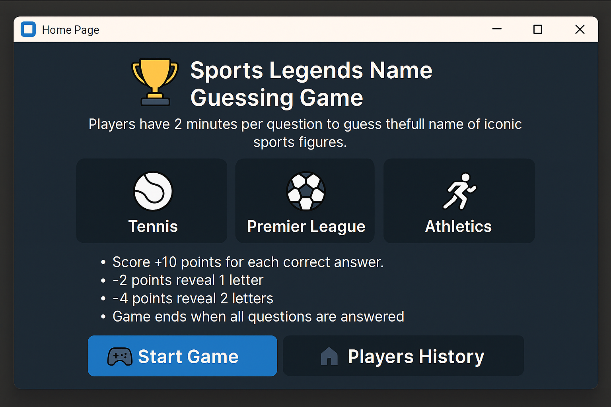

# 🏆 Sports Legends Name Guessing Game

A modern and interactive quiz game where players guess the names of
iconic sports legends from **Tennis**, **Premier League Football**, and
**Athletics**.\
The game features timed challenges, hints, a champion system, detailed
player history analytics, and a clean CustomTkinter user interface.

------------------------------------------------------------------------

## 📸 Screenshots

> These screenshots represent the design and layout of the game.\
> Your interface may differ slightly until you complete all pending
> refinements.\
> The final preview image shows the *ideal look* you are working toward.

### 🏠 Home Page


### 📝 Player Registration


### ⚙️ Game Options & Categories


### 🎯 Guessing Game


### 🟢 Results


### 🧮 Filters & Sorting


### 📊 Players History & Analytics


### ⭐ Final UI Preview (Work In Progress)



------------------------------------------------------------------------

## 🎮 Features

### 🧩 Gameplay

-   Guess full names of sports icons.
-   Timer per question (**120 seconds**).
-   Smart Hint System:
    -   Reveal first letter (--2 points)\
    -   Reveal two letters (--4 points)\
    -   Reveal half the name (--6 points)

### 🏆 Champion Tracking

Automatically records: - Highest Score\
- Player Name\
- Categories Played\
- Correct Answers\
- Total Questions\
- Hints Used\
- Date and Time

### 📊 Player History & Analytics

Includes: - Live Search\
- Sorting (Recent, Score, A--Z)\
- Filters:\
- Categories\
- Score Range\
- Hints Used\
- Date Range\
- Scrollable card-style history layout

### 🎨 UI & Experience

-   Light / Dark / System themes\
-   Smooth page navigation\
-   Modern CustomTkinter widgets

------------------------------------------------------------------------

## 📁 Project Structure

    NameGuessingGame/
    │── main.py
    │── gui/
    │   ├── home_page.py
    │   ├── registration_page.py
    │   ├── category_page.py
    │   ├── game_page.py
    │   ├── summary_page.py
    │   └── players_history_page.py
    │── data/
    │   ├── questions.json
    │   ├── players.json
    │   └── champion.json
    └── README.md

------------------------------------------------------------------------

## ▶️ How to Run

### 1. Clone the repository

``` bash
git clone https://github.com/Umamco/NameGuessingGame.git
```

### 2. Install Required Package

``` bash
pip install customtkinter
```

### 3. Start the Game

``` bash
python main.py
```

------------------------------------------------------------------------

## 🪟 Setup Instructions

### Windows

``` bash
pip install customtkinter
python main.py
```

### macOS

``` bash
pip3 install customtkinter
python3 main.py
```

### Linux

``` bash
pip3 install customtkinter
python3 main.py
```

------------------------------------------------------------------------

## 📚 Categories Included

### 🎾 Tennis

Grand Slam champions and finalists (2000--Present)

### ⚽ Premier League

Top scorers, title winners, elite players (2000--Present)

### 🏃 Athletics (100m & 200m)

Olympic and World Champions (2000--Present)

------------------------------------------------------------------------

## 🗂 Data Files

### Champion Data

`data/champion.json`

### Player History

`data/players.json`

### Questions Database

`data/questions.json`

------------------------------------------------------------------------

## 🚀 Future Enhancements

-   Boxing & Basketball categories\
-   Picture-based hints\
-   Multiplayer mode\
-   Online global leaderboard\
-   Export match history to CSV

------------------------------------------------------------------------

## ✨ Author

**Amin Umar (Jack)**\
Python Developer \| Sports Enthusiast
