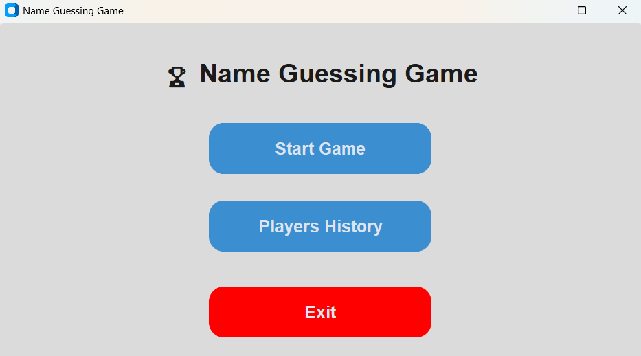
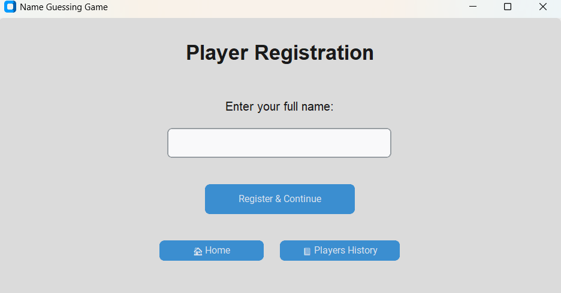
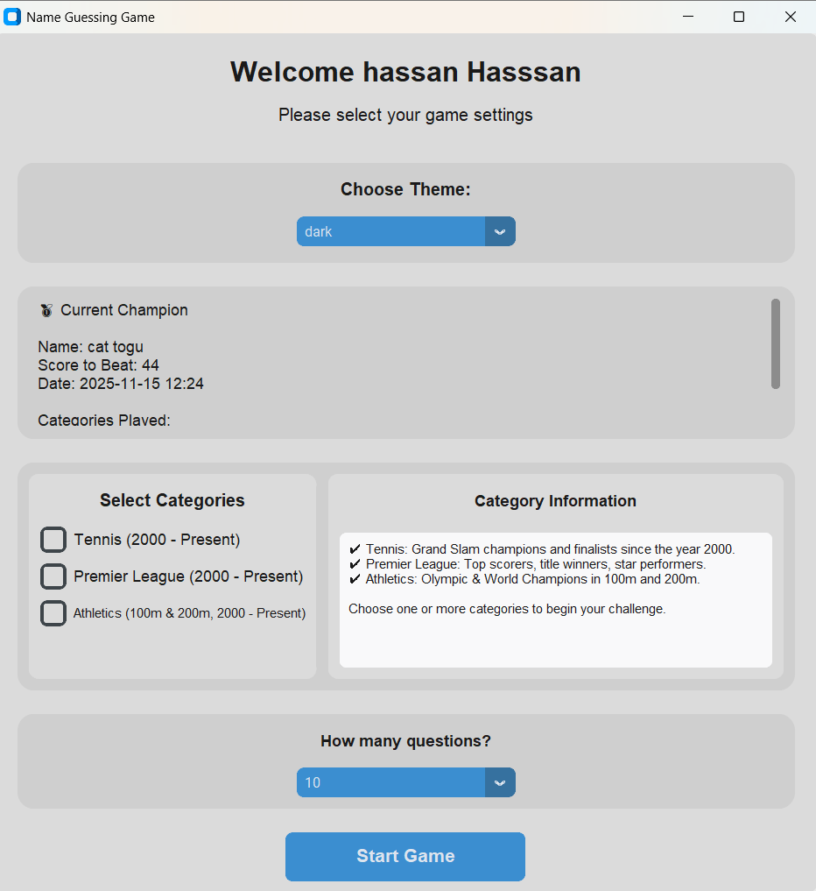
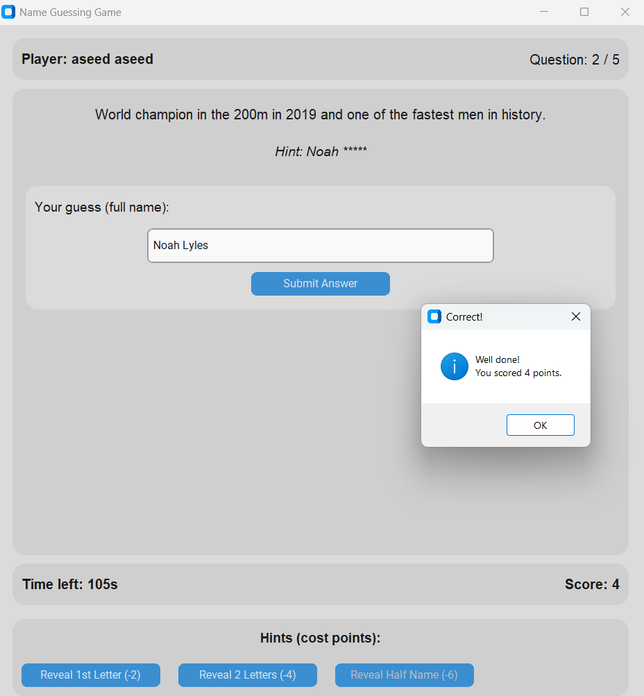
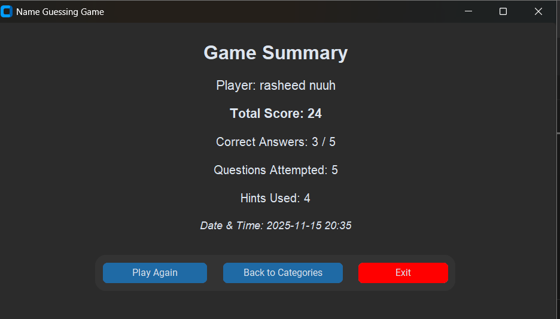
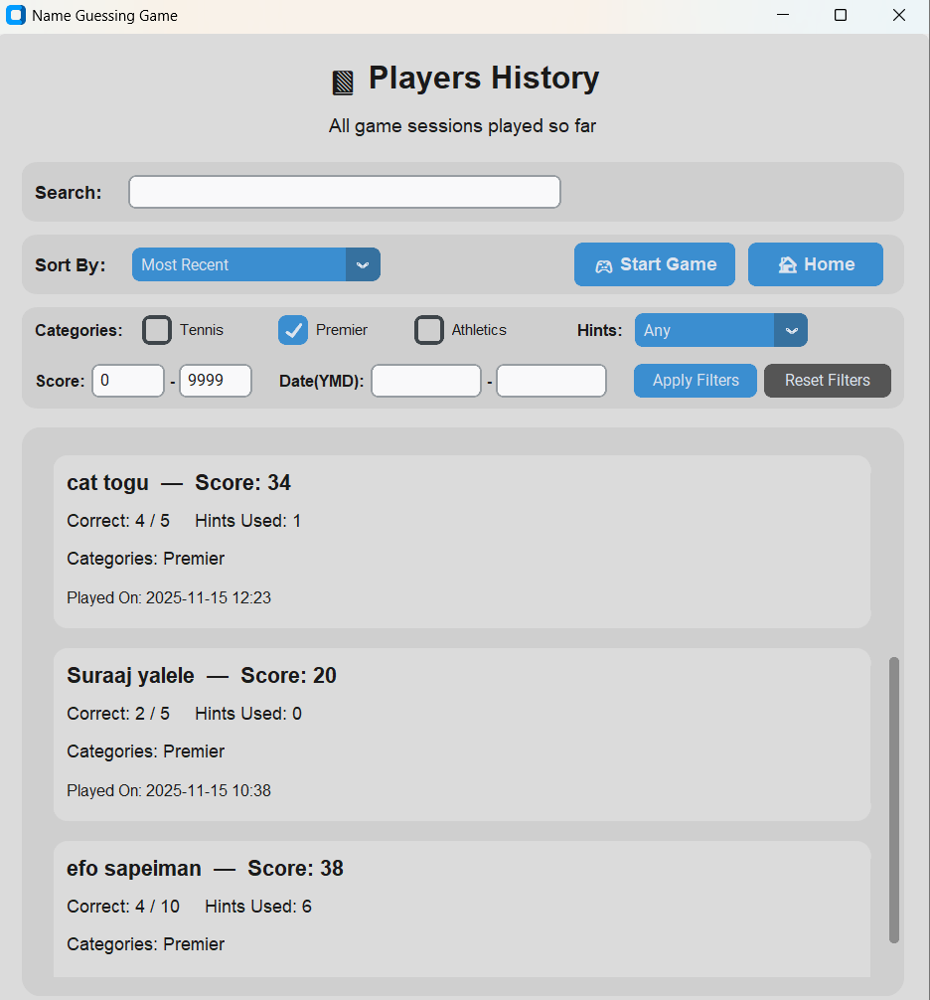
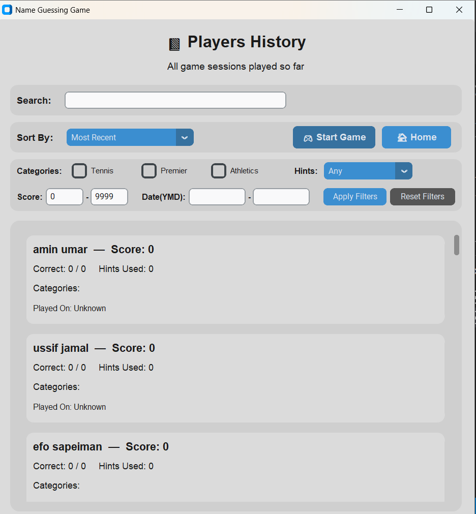

# 🏆 Sports Legends Name Guessing Game


A modern, intelligent quiz game where players guess the names of iconic sports legends from **Tennis**, **Premier League Football**, and **Athletics**.  
The game includes timed challenges, hints, champion recording, and a full analytics page with history, filtering, live search, and sorting.

---

## 📸 Screenshots

> **Replace placeholder image paths with your own**  
> (e.g., `/screenshots/home.png`, `/screenshots/history.png`)

### 🏠 Home Page


### 📝 Player Registration


## 


### 🎯 Guessing Game







### 📊 Players History & Analytics


---

## 🎮 Features

### 🧩 Core Gameplay
- Guess full names of sports legends.
- Timer per question (**120 seconds**).
- Smart Hint System:
  - Reveal 1st letter (–2 points)
  - Reveal 2 letters (–4 points)
  - Reveal half the name (–6 points)

### 🏆 Champion System
- Automatic tracking of the **all-time highest scorer**
- Stores:
  - Player Name  
  - Score  
  - Categories  
  - Date  
  - Correct Answers  
  - Total Questions  
  - Hints Used  

### 📊 Player History & Analytics
Includes:
- 🔍 Live search  
- ↕ Sorting (Recent, Highest Score, Alphabetical)  
- 🎛 Filters:
  - Categories  
  - Score range  
  - Hint usage  
  - Date range  
- Scrollable card-style layout  

### 🎨 UI Experience
- Dark / Light / System themes  
- Modern CustomTkinter widget styling  
- Smooth navigation flow  

---

## 📁 Project Structure

```
NameGuessingGame/
│── main.py
│── gui/
│   ├── home_page.py
│   ├── registration_page.py
│   ├── category_page.py
│   ├── game_page.py
│   ├── summary_page.py
│   └── players_history_page.py
│── data/
│   ├── players.json
│   ├── champion.json
│   └── questions.json
└── README.md
```

---

## ▶️ How to Run

### 1. Clone the repository
```bash
git clone https://github.com/Umamco/NameGuessingGame.git
```

### 2. Install Dependencies
```bash
pip install customtkinter
```

### 3. Run the Game
```bash
python main.py
```

---

## 🪟 Setup Instructions (Per Operating System)

### **Windows**
1. Ensure Python is installed (Run `python --version`).
2. Install CustomTkinter:
   ```bash
   pip install customtkinter
   ```
3. Double-click **main.py** *or* run:
   ```bash
   python main.py
   ```

### **macOS**
```bash
brew install python
pip3 install customtkinter
python3 main.py
```

### **Linux (Ubuntu/Debian)**
```bash
sudo apt install python3 python3-pip -y
pip3 install customtkinter
python3 main.py
```

---

## 📚 Categories Covered

### 🎾 **Tennis**
- Champions, finalists, era 2000 – Present

### ⚽ **Premier League**
- Top scorers, title winners, famous players

### 🏃 **Athletics (100m & 200m)**
- Olympic & World Champions since 2000

---

## 👑 Champion Data Location

```
data/champion.json
```

Automatically updated whenever a player beats the current champion.

---

## 🗂 Player History Data Location
```
data/players.json
```
Contains every game session played.

---

## 🚀 Future Improvements (Planned)
- Add Basketball & Boxing categories  
- Add picture-based hints  
- Multiplayer mode  
- Online leaderboard  
- Export history as CSV  

---

## 📜 License

This project is licensed under the **MIT License**.  
See the `LICENSE` file for details.

---

## ✨ Author

**Amin Umar (alias: Jack)**  
Python Developer & Sports Knowledge Enthusiast

